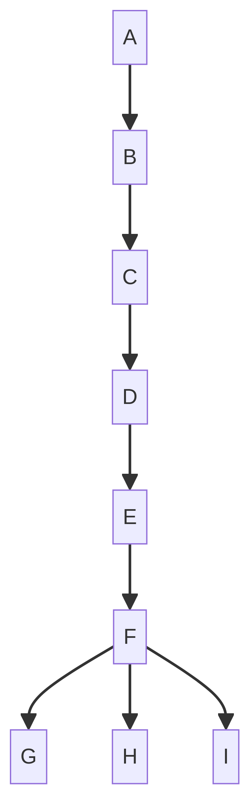

# Harness Tracker Skill

## 1. 개요

Harness Tracker Skill은 **Codex** 및 **Claude Code**와 같은 에이전트 런타임의 외부 출력을 분석하여 에이전트의 실행 하네스, 사용된 도구, 그리고 작업 흐름을 재구성하는 라이브러리입니다. 이 시스템은 에이전트의 내부 실행 환경을 직접 계측하는 대신, `stdout`, `JSON 이벤트`, `도구 호출 메타데이터`, `CLI 구조화된 출력`과 같은 **출력 정보만을 활용**하여 에이전트의 동작을 이해하고 시각화하는 데 중점을 둡니다. 이는 단순한 관찰 가능성(Observability) 시스템이 아닌, **출력 주도형 하네스 재구성 엔진(Output Driven Harness Reconstruction Engine)**으로 설계되었습니다.

## 2. 주요 기능

이 스킬은 다음과 같은 핵심 기능을 제공합니다:

*   **Claude Code / Codex 출력 수집(Ingestion)**: Claude Code 및 Codex CLI의 다양한 출력 형식을 수집합니다.
*   **이벤트 파싱(Event Parsing)**: 수집된 원본 출력을 구조화된 이벤트로 파싱합니다.
*   **정규 이벤트 정규화(Canonical Event Normalization)**: 다양한 소스의 이벤트를 통일된 `CanonicalEvent` 스키마로 변환합니다.
*   **하네스 상태 재구성(Harness State Reconstruction)**: 정규화된 이벤트를 기반으로 에이전트의 현재 하네스 상태를 재구성합니다.
*   **런타임 세션 관리(Runtime Session Management)**: 단일 에이전트 실행에 대한 세션을 관리하고 이벤트 스트림 및 상태 변경을 추적합니다.
*   **상태 조회 API(State Query API)**: 재구성된 하네스 상태에 대한 쿼리 인터페이스를 제공합니다.
*   **내부 모듈 임베딩(Internal Module Embedding)**: 다른 시스템에 쉽게 통합될 수 있는 라이브러리 형태로 제공됩니다.

## 3. 설계 원칙

이 스킬은 다음 설계 원칙에 따라 구축되었습니다:

*   **출력 전용 아키텍처(Output Only Architecture)**: 에이전트의 `stdout`, `JSON 이벤트`, `도구 호출 메타데이터`, `CLI 구조화된 출력`만을 사용하며, 내부 런타임 훅, 에이전트 메모리, 컨테이너 검사 등 내부 상태에는 접근하지 않습니다.
*   **이벤트 소싱 모델(Event Sourcing Model)**: 모든 하네스 상태는 이벤트 스트림으로부터 재구성됩니다. 상태는 저장되는 것이 아니라, 항상 이벤트를 리플레이하여 복원될 수 있습니다.
*   **소스 불가지론적 아키텍처(Source Agnostic Architecture)**: `Canonical Event Schema`를 사용하여 Claude Code, Codex CLI 및 향후 다른 에이전트 런타임과의 호환성을 보장합니다.
*   **두 채널 관찰 모델(Two Channel Observation Model)**: `기계 신뢰 채널(Machine Reliable Channel)` (도구 사용, JSON 이벤트 등)과 `모델 주석 채널(Model Annotation Channel)` (단계 힌트, 추론 힌트 등)을 구분하여, 모델 주석은 보조 정보로만 활용합니다.

## 4. 사용 방법 (예시)

이 스킬은 라이브러리 형태로 제공되므로, 에이전트의 출력을 이 스킬의 `Ingestion Layer`로 전달하여 사용합니다. 예를 들어, Node.js 환경에서 `child process`의 `stdout`을 스트림으로 연결하거나, 특정 JSON 이벤트를 직접 `push`할 수 있습니다. 이후 `Session Runtime`을 통해 현재 하네스 상태를 조회하거나 이벤트 스트림을 구독할 수 있습니다.

```typescript
import { HarnessSession, createSession } from 'harness-tracker-skill';

const session: HarnessSession = createSession('codex');

// 에이전트의 출력을 라인별로 주입
session.pushLine('...');

// 또는 원본 데이터를 직접 주입
session.pushRaw({ event: 'tool_call', payload: { tool: 'shell', command: 'ls -l' } });

// 상태 변경 구독
session.onStateChange((newState) => {
  console.log('Current Harness State:', newState);
});

// 이벤트 스트림 구독
session.onEvent((event) => {
  console.log('New Event:', event);
});

// 현재 상태 조회
const currentState = session.getState();
console.log('Final State:', currentState);

// 요약 정보 조회
const summary = session.getSummary();
console.log('Session Summary:', summary);
```

## 5. 아키텍처 개요



이 스킬은 다음과 같은 고수준 아키텍처로 구성됩니다:

1.  **Output Ingestion Layer**: 에이전트 런타임(Claude / Codex)의 `stdout`을 포함한 다양한 출력을 수집합니다.
2.  **Event Parser**: 수집된 출력을 소스별 로직에 따라 파싱하여 구조화된 이벤트로 변환합니다.
3.  **Canonical Event Layer**: 파싱된 이벤트를 정규화된 스키마를 가진 `Canonical Event`로 변환합니다.
4.  **State Reducer**: `Canonical Event`를 폴드(fold)하여 `Harness State`를 재구성합니다.
5.  **Session Runtime**: 재구성된 상태를 관리하고, `State API`, `Event Stream`, `Summary API`를 통해 외부 인터페이스를 제공합니다.

## 6. 데이터 모델

### 6.1 Raw Event

원본 이벤트의 보존 구조로, `source`, `ts`, `line`, `data` 필드를 포함합니다. 이는 파서 재해석, 스키마 변경 대응, 디버깅을 위해 원본 데이터를 항상 보존합니다.

### 6.2 Canonical Event

모든 소스 이벤트를 정규화하는 통일된 구조입니다. `id`, `runId`, `kind` (예: `session_start`, `tool_call`, `file_write` 등), `ts`, `title`, `status`, `payload`, `raw` 필드를 포함합니다.

### 6.3 Harness State

에이전트의 현재 하네스 상태를 나타내는 구조입니다. `runId`, `source`, `phase` (예: `planning`, `tooling`, `completed` 등), `startedAt`, `endedAt`, `eventCount`, `messages`, `toolCalls`, `toolFailures`, `retries`, `approvalsPending`, `activeTools`, `activeMcpServers`, `activeSubagents`, `touchedFiles`, `writtenFiles`, `readFiles`, `recentCommands`, `lastResult`, `lastError` 등의 필드를 포함합니다.

### 6.4 Harness Summary

단일 에이전트 실행 세션의 요약 정보를 제공하는 구조입니다. `runId`, `source`, `durationMs`, `totalEvents`, `totalToolCalls`, `totalFilesWritten`, `totalCommands`, `approvalsSeen`, `retries`, `completed`, `failed` 등의 필드를 포함합니다.

## 7. 참고 자료

*   [GitHub Repository: harness-tracker-skill](https://github.com/cheeze-lee/harness-tracker-skill)

